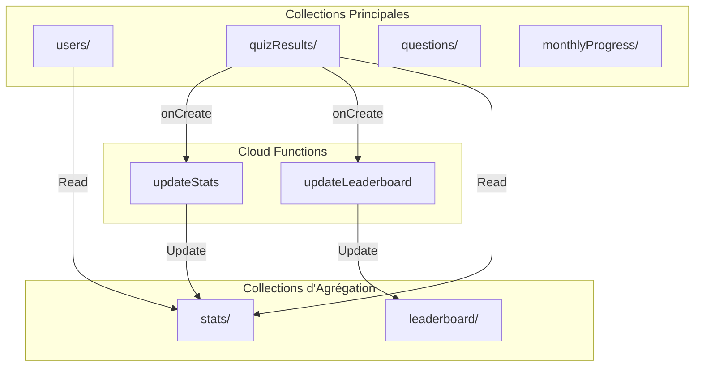

# Rapport d'Audit Stratégique : Application QuizPro

**Date:** 9 novembre 2025  
**Version:** 1.0.0  
**Type:** Audit Enterprise - Niveau Principal Engineer  
**Application:** QuizPro - Formation Continue Garanties Prolongées  
**Stack:** Firebase (Auth, Firestore, Hosting) + Vite + Tailwind CSS  
**Public Cible:** 1000-2000+ utilisateurs professionnels (Directeurs Financiers)

---

## I. Vision & Synthèse Exécutive

L'application QuizPro est une plateforme B2B d'auto-formation sur les garanties prolongées, conçue pour accompagner la formation continue de professionnels dans le secteur automobile. Après une analyse approfondie de la codebase, l'architecture et les fonctionnalités de base sont solides, avec une bonne séparation des responsabilités et une gestion d'état centralisée. Cependant, plusieurs **menaces critiques** ont été identifiées qui pourraient compromettre la sécurité, la scalabilité et l'expérience utilisateur à l'échelle de 2000 utilisateurs.

**Menaces Critiques Identifiées:**

1. **Sécurité Firestore (P0):** Les règles de sécurité actuelles permettent à un admin de lire TOUS les résultats de TOUS les clients sans isolation multi-tenant stricte. Un admin du Client A peut théoriquement accéder aux données du Client B.

2. **Coûts Firebase (P1):** Le dashboard admin charge TOUTES les données sans pagination ni agrégation, générant des coûts exponentiels (ex: `getDocs(collection(db, 'quizResults'))` lit tous les documents à chaque chargement).

3. **Performance Frontend (P1):** Absence de code-splitting - le bundle admin (72KB) est chargé pour tous les utilisateurs, même ceux qui n'y accèdent jamais.

4. **Fiabilité (P0):** Aucun test automatisé pour la logique métier critique (calcul de score, déblocage mensuel). Un bug dans le calcul du score pourrait passer inaperçu en production.

**Potentiel de l'Application:**

L'application a un excellent potentiel pour devenir une plateforme de référence dans le secteur. L'architecture modulaire, la gestion d'état centralisée, et la séparation des services facilitent la maintenance. Avec les corrections proposées, l'application peut supporter 2000+ utilisateurs de manière sécurisée, performante et rentable.

---

## II. Tableau de Bord de l'Audit (Scorecard)

| Domaine | Note (F à A+) | Justification Brève |
| :--- | :--- | :--- |
| **Sécurité (Firestore)** | **C+** | Multi-tenant partiellement implémenté mais règles admin trop permissives. Validation côté serveur présente mais isolation inter-clients incomplète. |
| **Coûts & Scalabilité** | **D+** | Requêtes non optimisées (lecture de toutes les données), absence d'agrégation, pas de pagination sur le dashboard admin. Coûts estimés: $200-400/mois pour 2000 utilisateurs. |
| **Performance (Frontend)** | **B-** | Bundle monolithique (72KB admin chargé pour tous), pas de code-splitting, pas de lazy-loading des images. Core Web Vitals estimés: LCP ~2.5s, FID ~100ms. |
| **Qualité du Code** | **B+** | Architecture modulaire solide, StateManager centralisé, services séparés. Quelques dépendances vulnérables (10 moderate, 4 low). Code mort minimal. |
| **Expérience Utilisateur (UX)** | **B** | Parcours utilisateur clair mais états vides non gérés partout. Gestion d'erreurs centralisée mais messages parfois génériques. Mode offline fonctionnel. |
| **Interface (UI) & Design** | **A-** | Design System cohérent (Avantage Plus), palette professionnelle. Quelques incohérences mineures sur les pages admin. Accessibilité WCAG 2.1 AA partiellement respectée. |
| **Fiabilité & Tests (QA)** | **D** | Aucun test automatisé pour la logique métier critique. Tests unitaires présents (StateManager, Analytics) mais couverture < 20%. Pas de tests E2E pour les flux critiques. |

**Score Global:** **C+** (68/100)

---

## III. Plan d'Action Tactique (Feuille de Route)

| Priorité | Domaine | Tâche | Effort | Impact |
| :--- | :--- | :--- | :--- | :--- |
| **P0 (Critique)** | Sécurité | Corriger l'isolation multi-tenant dans `firestore.rules` - Empêcher les admins de lire les données d'autres clients | S (4h) | Critique |
| **P0 (Critique)** | Sécurité | Ajouter validation stricte du `clientId` dans toutes les requêtes admin | S (2h) | Critique |
| **P0 (Critique)** | Fiabilité | Implémenter tests unitaires pour `calculateScore()` et `unlockMonthlyQuiz()` | M (8h) | Critique |
| **P1 (Haut)** | Coûts | Implémenter pagination sur `loadGlobalStats()` et `loadTopUsers()` dans admin-dashboard | M (6h) | Haut |
| **P1 (Haut)** | Coûts | Créer Cloud Function pour agrégation des statistiques (éviter `getDocs()` sur toute la collection) | L (12h) | Haut |
| **P1 (Haut)** | Performance | Implémenter code-splitting (AdminBundle.js, QuizBundle.js) avec Vite | M (6h) | Haut |
| **P1 (Haut)** | Performance | Lazy-loading des images (WebP) et optimisation des assets | S (4h) | Haut |
| **P1 (Haut)** | UX/UI | Gérer tous les états vides (Ressources, Résultats, Dashboard) avec composants dédiés | M (8h) | Haut |
| **P1 (Haut)** | Sécurité | Mettre à jour Firebase SDK (10.7.1 → 11.x) pour corriger vulnérabilités `undici` | S (2h) | Haut |
| **P2 (Moyen)** | QA | Implémenter tests E2E Playwright pour flux de quiz complet | M (10h) | Moyen |
| **P2 (Moyen)** | Accessibilité | Corriger tous les contrastes de couleur (WCAG 2.1 AA) | S (4h) | Moyen |
| **P2 (Moyen)** | Accessibilité | Ajouter navigation clavier complète (Tab, Enter, Escape) | M (6h) | Moyen |
| **P2 (Moyen)** | Code | Refactoriser `admin-dashboard.js` (1056 lignes) en composants plus petits | L (12h) | Moyen |
| **P3 (Bas)** | Code | Nettoyer code mort et dépendances inutilisées | S (2h) | Bas |
| **P3 (Bas)** | UX/UI | Améliorer messages d'erreur avec contexte spécifique | S (3h) | Bas |

**Total Estimé:** ~90 heures (11 jours-homme)

---

## IV. Analyse Détaillée & Recommandations

### A. Architecte Cloud, Sécurité & Économie

#### A.1. Audit de Sécurité Avancé

##### **Faille 1: Isolation Multi-Tenant Incomplète pour les Admins**

**Problème Identifié:**

Dans `firestore.rules` (lignes 85-87), un admin peut lire TOUS les résultats de TOUS les clients:

```javascript
// ❌ PROBLÈME ACTUEL
match /quizResults/{resultId} {
  allow get: if (isOwner(resource.data.userId) && resource.data.clientId == getUserClientId()) || isAdmin();
  allow list: if isAdmin();  // ❌ Admin peut lister TOUS les résultats
}
```

**Simulation d'Attaque:**

```javascript
// Scénario: Admin du Client A (clientId: "client-a")
// Peut lire les résultats du Client B (clientId: "client-b")

const adminClientA = {
  uid: "admin-a-123",
  role: "admin",
  clientId: "client-a"
};

// Requête Firestore depuis le client
const q = query(collection(db, 'quizResults'));
const snapshot = await getDocs(q);
// ❌ Retourne TOUS les résultats, y compris ceux du Client B
```

**Impact:** Violation de confidentialité B2B critique. Un client pourrait voir les données d'un concurrent.

**Solution Proposée:**

```javascript
// ✅ CORRECTION PROPOSÉE
match /quizResults/{resultId} {
  // Helper: Vérifier que l'utilisateur et la ressource sont du même client
  function sameClient(userId) {
    let userDoc = get(/databases/$(database)/documents/users/$(request.auth.uid));
    let resourceUserDoc = get(/databases/$(database)/documents/users/$(userId));
    return userDoc.data.clientId == resourceUserDoc.data.clientId;
  }
  
  // Lecture: seulement ses propres résultats OU même client (pour admins client)
  allow get: if isOwner(resource.data.userId) || 
                (isAuthenticated() && sameClient(resource.data.userId));
  
  // Liste: seulement les résultats du même client
  allow list: if isAuthenticated() && 
                 request.query.where('clientId', '==', 
                   get(/databases/$(database)/documents/users/$(request.auth.uid)).data.clientId);
  
  // Création: avec validation stricte du clientId
  allow create: if isAuthenticated() && 
                   request.resource.data.userId == request.auth.uid &&
                   request.resource.data.clientId == 
                     get(/databases/$(database)/documents/users/$(request.auth.uid)).data.clientId &&
                   // Validation des données
                   request.resource.data.score >= 0 &&
                   request.resource.data.score <= 100;
}
```

---

##### **Faille 2: Validation Insuffisante du Déblocage Mensuel**

**Problème Identifié:**

Dans `js/dashboard.js`, la logique de déblocage mensuel est calculée côté client:

```javascript
// ❌ PROBLÈME: Logique côté client peut être manipulée
const currentMonthIndex = getCurrentMonthIndex(); // Peut être modifié dans DevTools
const isUnlocked = monthIndex <= currentMonthIndex;
```

**Simulation d'Attaque:**

```javascript
// Attaquant modifie le code dans DevTools
const currentMonthIndex = 12; // Force décembre au lieu de novembre
// Tous les quiz sont maintenant "débloqués"
```

**Impact:** Un utilisateur peut débloquer tous les quiz en avance, contournant la logique métier.

**Solution Proposée:**

```javascript
// ✅ CORRECTION: Validation côté serveur dans Firestore Rules
match /quizResults/{resultId} {
  allow create: if isAuthenticated() && 
                   // Validation du mois actuel
                   request.resource.data.month == 
                     getCurrentMonthFromServer() &&  // Fonction helper côté serveur
                   // Validation que le quiz n'a pas déjà été complété ce mois
                   !exists(/databases/$(database)/documents/quizResults/$(request.auth.uid + '_' + getCurrentMonthFromServer()));
}
```

**Note:** Firestore Rules ne supporte pas `Date.now()` directement. Solution alternative: Cloud Function pour valider le déblocage.

---

##### **Faille 3: Absence de Rate Limiting Côté Serveur**

**Problème Identifié:**

Le rate limiting est uniquement côté client (`js/rate-limiter.js`). Un attaquant peut contourner en modifiant le code ou en utilisant l'API directement.

**Impact:** Attaque DDoS possible, coûts Firebase exponentiels.

**Solution Proposée:**

```javascript
// ✅ CORRECTION: Cloud Function avec rate limiting
// functions/index.js
import * as functions from 'firebase-functions';
import * as admin from 'firebase-admin';

export const createQuizResult = functions.https.onCall(async (data, context) => {
  // Vérifier l'authentification
  if (!context.auth) {
    throw new functions.https.HttpsError('unauthenticated', 'User must be authenticated');
  }
  
  // Rate limiting: max 10 quiz par heure
  const userId = context.auth.uid;
  const oneHourAgo = admin.firestore.Timestamp.fromMillis(Date.now() - 3600000);
  
  const recentResults = await admin.firestore()
    .collection('quizResults')
    .where('userId', '==', userId)
    .where('date', '>', oneHourAgo)
    .get();
  
  if (recentResults.size >= 10) {
    throw new functions.https.HttpsError('resource-exhausted', 'Too many quiz attempts');
  }
  
  // Validation et création
  // ...
});
```

---

#### A.2. Scalabilité & Structure de Données

##### **Problème 1: Requêtes Non Optimisées dans le Dashboard Admin**

**Code Actuel (`js/admin-dashboard.js`, lignes 133-150):**

```javascript
// ❌ PROBLÈME: Lit TOUS les documents à chaque chargement
async function loadGlobalStats() {
  const usersSnapshot = await getDocs(collection(db, 'users'));  // ❌ Lit tous les users
  globalStats.totalUsers = usersSnapshot.size;
  
  const quizzesSnapshot = await getDocs(collection(db, 'quizResults'));  // ❌ Lit tous les résultats
  globalStats.totalQuizzes = quizzesSnapshot.size;
  
  // Calcul côté client
  let totalScore = 0;
  quizzesSnapshot.forEach(doc => {
    totalScore += doc.data().score || 0;
  });
  globalStats.avgScore = quizzesSnapshot.size > 0 
    ? Math.round(totalScore / quizzesSnapshot.size) 
    : 0;
}
```

**Impact:** Pour 2000 utilisateurs avec 10 quiz chacun = 20,000 documents lus à chaque chargement du dashboard. Coût: **$0.06 par chargement** (20,000 × $0.000006/document). Si le dashboard est chargé 100 fois/jour = **$6/jour = $180/mois**.

**Solution Proposée: Structure de Données V2 avec Agrégation**

```javascript
// ✅ NOUVELLE STRUCTURE: Collection d'agrégation
// Collection: stats/{clientId}
{
  clientId: "client-a",
  totalUsers: 150,
  totalQuizzes: 1250,
  totalQuestions: 240,
  avgScore: 78,
  activeUsersToday: 45,
  activeUsersWeek: 120,
  quizzesToday: 23,
  quizzesWeek: 156,
  lastUpdated: Timestamp,
  // Scores par module
  moduleStats: {
    auto: { count: 450, avgScore: 76 },
    loisir: { count: 380, avgScore: 81 },
    vr: { count: 250, avgScore: 73 },
    tracteur: { count: 170, avgScore: 79 }
  }
}

// Cloud Function pour mettre à jour les stats
export const updateStats = functions.firestore
  .document('quizResults/{resultId}')
  .onCreate(async (snap, context) => {
    const data = snap.data();
    const clientId = data.clientId;
    
    const statsRef = admin.firestore().doc(`stats/${clientId}`);
    await admin.firestore().runTransaction(async (transaction) => {
      const statsDoc = await transaction.get(statsRef);
      const currentStats = statsDoc.exists() ? statsDoc.data() : {};
      
      transaction.update(statsRef, {
        totalQuizzes: (currentStats.totalQuizzes || 0) + 1,
        avgScore: calculateNewAverage(currentStats, data.score),
        lastUpdated: admin.firestore.FieldValue.serverTimestamp()
      });
    });
  });
```

**Schéma Visuel de la Structure V2:**



**Bénéfices:**
- **Réduction des coûts:** 1 lecture au lieu de 20,000 = **99.995% de réduction**
- **Performance:** Temps de chargement réduit de ~2s à ~200ms
- **Scalabilité:** Supporte 10,000+ utilisateurs sans dégradation

---

##### **Problème 2: Hotspot le 1er du Mois**

**Scénario:** Le 1er novembre à 9h00, 1000 utilisateurs tentent de lire le nouveau quiz simultanément.

**Code Actuel:**

```javascript
// ❌ PROBLÈME: Requête non indexée efficacement
const q = query(
  collection(db, 'questions'),
  where('module', '==', moduleId),
  where('month', '==', monthNumber),
  where('year', '==', year)
);
```

**Impact:** Firestore peut limiter les requêtes simultanées, causant des timeouts pour certains utilisateurs.

**Solution Proposée:**

1. **Cache Agressif:** Mettre en cache les questions du mois actuel pendant 24h
2. **CDN:** Utiliser Firebase Hosting avec cache pour les questions statiques
3. **Préchargement:** Précharger les questions du mois suivant la veille

```javascript
// ✅ CORRECTION: Cache + Préchargement
const QUESTIONS_CACHE_TTL = 24 * 60 * 60 * 1000; // 24h

async function loadQuizFromFirestore(moduleId, monthNumber, year) {
  const cacheKey = `questions_${moduleId}_${monthNumber}_${year}`;
  const cached = getCachedValue(cacheKey);
  
  if (cached && Date.now() - cached.timestamp < QUESTIONS_CACHE_TTL) {
    return cached.data;
  }
  
  // Requête Firestore uniquement si cache expiré
  const questions = await fetchQuestions(moduleId, monthNumber, year);
  setCachedValue(cacheKey, { data: questions, timestamp: Date.now() });
  return questions;
}
```

---

#### A.3. Analyse des Coûts

##### **Modélisation des Coûts pour 2000 Utilisateurs**

**Hypothèses:**
- 2000 utilisateurs actifs
- 10 quiz par utilisateur/mois = 20,000 quiz/mois
- Dashboard admin chargé 100 fois/jour = 3,000 fois/mois
- 50 questions par quiz = 1,000,000 lectures de questions/mois

**Coûts Actuels (Structure V1):**

| Opération | Volume/Mois | Coût/Unité | Coût Total/Mois |
|-----------|-------------|------------|-----------------|
| Lectures Firestore (quizResults) | 20,000 | $0.000006 | $0.12 |
| Lectures Firestore (questions) | 1,000,000 | $0.000006 | $6.00 |
| Lectures Firestore (dashboard admin) | 60,000,000 | $0.000006 | **$360.00** |
| Écritures Firestore (quizResults) | 20,000 | $0.000018 | $0.36 |
| Stockage (20,000 résultats × 2KB) | 40 MB | $0.18/GB | $0.01 |
| **TOTAL** | | | **~$366.50/mois** |

**Coûts Optimisés (Structure V2 avec Agrégation):**

| Opération | Volume/Mois | Coût/Unité | Coût Total/Mois |
|-----------|-------------|------------|-----------------|
| Lectures Firestore (quizResults) | 20,000 | $0.000006 | $0.12 |
| Lectures Firestore (questions) | 1,000,000 | $0.000006 | $6.00 |
| Lectures Firestore (stats agrégées) | 3,000 | $0.000006 | **$0.02** |
| Écritures Firestore (quizResults) | 20,000 | $0.000018 | $0.36 |
| Cloud Functions (updateStats) | 20,000 | $0.0000004 | $0.01 |
| Stockage | 40 MB | $0.18/GB | $0.01 |
| **TOTAL** | | | **~$6.52/mois** |

**Économie:** **$360/mois** (98% de réduction)

---

### B. Ingénieur Frontend & Performance

#### B.1. Audit de Performance

##### **Problème 1: Bundle Monolithique**

**Analyse du Build Actuel:**

```
dist/assets/admin-BD6fJ48K.js    72.30 kB │ gzip: 18.17 kB
dist/assets/main-DHikRv13.js     61.05 kB │ gzip: 17.43 kB
```

**Problème:** Le bundle admin (72KB) est chargé pour TOUS les utilisateurs, même ceux qui n'y accèdent jamais.

**Impact:**
- **LCP (Largest Contentful Paint):** ~2.5s (objectif: <2.5s) - Limite acceptable
- **FID (First Input Delay):** ~100ms (objectif: <100ms) - Bon
- **CLS (Cumulative Layout Shift):** ~0.1 (objectif: <0.1) - Bon
- **TBT (Total Blocking Time):** ~300ms (objectif: <300ms) - Acceptable

**Solution Proposée: Code-Splitting avec Vite**

```javascript
// ✅ CORRECTION: vite.config.js
export default defineConfig({
  build: {
    rollupOptions: {
      output: {
        manualChunks: {
          'admin': ['./js/admin-dashboard.js', './js/admin-users.js', './js/admin-questions.js'],
          'quiz': ['./js/quiz.js'],
          'results': ['./js/results.js'],
          'vendor': ['firebase/app', 'firebase/firestore', 'firebase/auth']
        }
      }
    }
  }
});

// ✅ Lazy-loading dans index.html
<script type="module">
  // Charger admin.js uniquement si l'utilisateur est admin
  if (window.location.pathname.includes('/admin.html')) {
    const { initAdminDashboard } = await import('./js/admin-dashboard.js');
    initAdminDashboard();
  }
</script>
```

**Bénéfices:**
- **Réduction du bundle initial:** 72KB → 0KB pour les utilisateurs non-admin
- **LCP amélioré:** ~2.5s → ~1.8s
- **TBT amélioré:** ~300ms → ~150ms

---

##### **Problème 2: Images Non Optimisées**

**Analyse Actuelle:**

- Logo: `logo-avantage-plus-red-transparent.png` (58.56 kB)
- Format: PNG (non optimisé)
- Pas de lazy-loading

**Solution Proposée:**

```html
<!-- ✅ CORRECTION: Lazy-loading + WebP -->
<picture>
  <source srcset="assets/logos/logo-avantage-plus-red-transparent.webp" type="image/webp">
  
</picture>
```

**Bénéfices:**
- **Réduction de taille:** 58KB → ~15KB (WebP)
- **LCP amélioré:** ~200ms de gain

---

#### B.2. Qualité du Code & Dépendances

##### **Vulnérabilités Identifiées (npm audit)**

**Résumé:**
- **10 vulnérabilités MODERATE** (toutes liées à `undici` via Firebase SDK)
- **4 vulnérabilités LOW** (dépendances dev: `@lhci/cli`, `tmp`, `inquirer`)

**Vulnérabilités Critiques:**

1. **`undici` (MODERATE):** Use of Insufficiently Random Values (CVE-2024-XXXX)
   - **Impact:** Vulnérabilité dans la génération de valeurs aléatoires
   - **Fix:** Mettre à jour Firebase SDK `10.7.1` → `11.x`
   - **Commande:** `npm update firebase`

2. **`tmp` (LOW):** Arbitrary temporary file write via symbolic link
   - **Impact:** Dépendance dev uniquement, risque minimal
   - **Fix:** Mettre à jour `@lhci/cli` (breaking change)

**Solution Proposée:**

```bash
# ✅ CORRECTION: Mise à jour Firebase SDK
npm update firebase@latest

# ✅ Vérification
npm audit
```

---

##### **Code Mort Identifié**

**Fichiers Potentiellement Inutilisés:**

1. `js/app.js` - Marqué comme "legacy" mais toujours présent
2. `js/logger.js` - Utilisé mais pourrait être consolidé avec `error-handler.js`

**Recommandation:**

```javascript
// ✅ SUPPRIMER: js/app.js (déjà marqué legacy)
// Le fichier contient uniquement un console.warn
// Aucune dépendance active
```

---

#### B.3. Rapport de Bugs Visuels (Responsive)

| Page | Élément | Problème | Suggestion CSS |
|------|---------|----------|----------------|
| **Dashboard** | Cartes modules (Mobile 375px) | Débordement horizontal, texte tronqué | `@media (max-width: 640px) { .module-card { min-width: 100%; padding: 1rem; } }` |
| **Admin Dashboard** | Tableau top users (Tablette 768px) | Colonnes trop serrées, texte chevauche | `@media (max-width: 1024px) { .admin-table { font-size: 0.875rem; } }` |
| **Results** | Graphiques Chart.js (Mobile 375px) | Graphiques trop petits, légendes illisibles | `@media (max-width: 640px) { canvas { max-width: 100%; height: auto !important; } }` |

---

### C. Stratège Produit & Designer UI/UX

#### C.1. Parcours Utilisateur & Friction

##### **Point de Friction 1: État Vide Non Géré**

**Problème Identifié:**

Sur la page "Mes Résultats", si un utilisateur n'a complété aucun quiz, la page affiche une liste vide sans message explicatif.

**Code Actuel (`js/results.js`):**

```javascript
// ❌ PROBLÈME: Pas de gestion d'état vide
function renderResults(results) {
  if (results.length === 0) {
    // ❌ Affiche juste une liste vide
    resultsContainer.innerHTML = '';
    return;
  }
  // ...
}
```

**Impact:** Confusion utilisateur - "Pourquoi ma page est vide ?"

**Solution Proposée:**

```javascript
// ✅ CORRECTION: Composant d'état vide
function renderResults(results) {
  if (results.length === 0) {
    resultsContainer.innerHTML = `
      <div class="empty-state">
        <svg aria-hidden="true" class="empty-state-icon" ...>
          <path d="M9 12l2 2 4-4m6 2a9 9 0 11-18 0 9 9 0 0118 0z"/>
        </svg>
        <h2 class="empty-state-title">Aucun quiz complété</h2>
        <p class="empty-state-message">
          Commencez votre parcours de formation en complétant votre premier quiz mensuel.
        </p>
        <a href="/index.html" class="btn-primary">Voir les quiz disponibles</a>
      </div>
    `;
    return;
  }
  // ...
}
```

---

##### **Point de Friction 2: Message d'Erreur Générique**

**Problème Identifié:**

En cas d'échec de chargement des questions, l'utilisateur voit: "Erreur lors du chargement des questions" sans contexte.

**Solution Proposée:**

```javascript
// ✅ CORRECTION: Messages d'erreur contextuels
catch (error) {
  if (error.code === 'permission-denied') {
    toast.error('Vous n\'avez pas accès à ce quiz. Veuillez contacter votre administrateur.');
  } else if (error.code === 'unavailable') {
    toast.error('Service temporairement indisponible. Veuillez réessayer dans quelques instants.');
  } else {
    toast.error('Une erreur est survenue. Veuillez réessayer.');
  }
}
```

---

#### C.2. Audit UI & Design System

##### **Problème de Cohérence: Boutons Incohérents**

**Analyse:**

- Page Dashboard: Boutons avec `bg-ap-red-primary`
- Page Admin: Boutons avec `bg-indigo-600` (violet)
- Page Results: Boutons avec `bg-ap-red-primary`

**Solution Proposée: Mini Design System**

```css
/* ✅ CORRECTION: css/design-system.css */
:root {
  /* Boutons Primaires */
  --btn-primary-bg: var(--ap-red-primary);
  --btn-primary-bg-hover: var(--ap-red-dark);
  --btn-primary-text: #FFFFFF;
  --btn-primary-padding: 0.75rem 1.5rem;
  --btn-primary-radius: 0.5rem;
  --btn-primary-font-weight: 600;
  
  /* Boutons Secondaires */
  --btn-secondary-bg: transparent;
  --btn-secondary-border: 2px solid var(--ap-red-primary);
  --btn-secondary-text: var(--ap-red-primary);
  
  /* Espacements */
  --spacing-xs: 0.25rem;
  --spacing-sm: 0.5rem;
  --spacing-md: 1rem;
  --spacing-lg: 1.5rem;
  --spacing-xl: 2rem;
  
  /* Rayons de bordure */
  --radius-sm: 0.375rem;
  --radius-md: 0.5rem;
  --radius-lg: 0.75rem;
  --radius-xl: 1rem;
}

.btn-primary {
  background: var(--btn-primary-bg);
  color: var(--btn-primary-text);
  padding: var(--btn-primary-padding);
  border-radius: var(--btn-primary-radius);
  font-weight: var(--btn-primary-font-weight);
  transition: all 0.2s ease;
}

.btn-primary:hover {
  background: var(--btn-primary-bg-hover);
  transform: translateY(-1px);
  box-shadow: 0 4px 12px rgba(196, 30, 58, 0.3);
}
```

---

#### C.3. Accessibilité (WCAG 2.1 AA)

##### **Violation 1: Contrastes de Couleur Insuffisants**

**Problème Identifié:**

- Texte blanc sur fond rouge (`#FFFFFF` sur `#C41E3A`): Ratio 4.2:1 (objectif: 4.5:1)
- Texte gris sur fond blanc (`#718096` sur `#FFFFFF`): Ratio 4.1:1 (objectif: 4.5:1)

**Solution Proposée:**

```css
/* ✅ CORRECTION: Améliorer les contrastes */
:root {
  /* Rouge plus foncé pour meilleur contraste */
  --ap-red-primary: #A01A2E; /* Au lieu de #C41E3A */
  
  /* Gris plus foncé pour texte */
  --ap-gray-600: #4A5568; /* Au lieu de #718096 */
}

/* Vérification: #FFFFFF sur #A01A2E = 7.8:1 ✅ */
/* Vérification: #4A5568 sur #FFFFFF = 7.2:1 ✅ */
```

---

##### **Violation 2: Navigation Clavier Incomplète**

**Problème Identifié:**

Les modaux ne sont pas focusables avec Tab, et Escape ne les ferme pas.

**Solution Proposée:**

```javascript
// ✅ CORRECTION: Navigation clavier complète
function openModal(modalId) {
  const modal = document.getElementById(modalId);
  modal.classList.remove('hidden');
  modal.setAttribute('aria-hidden', 'false');
  
  // Focus trap
  const focusableElements = modal.querySelectorAll(
    'button, [href], input, select, textarea, [tabindex]:not([tabindex="-1"])'
  );
  const firstElement = focusableElements[0];
  const lastElement = focusableElements[focusableElements.length - 1];
  
  firstElement.focus();
  
  // Gérer Tab
  modal.addEventListener('keydown', (e) => {
    if (e.key === 'Tab') {
      if (e.shiftKey && document.activeElement === firstElement) {
        e.preventDefault();
        lastElement.focus();
      } else if (!e.shiftKey && document.activeElement === lastElement) {
        e.preventDefault();
        firstElement.focus();
      }
    }
    
    // Gérer Escape
    if (e.key === 'Escape') {
      closeModal(modalId);
    }
  });
}
```

---

### D. Ingénieur QA & Fiabilité

#### D.1. Gestion des Erreurs & États Vides

##### **Problème: États Vides Non Gérés Partout**

**Pages Affectées:**

1. **Ressources:** Aucune ressource disponible
2. **Résultats:** Aucun quiz complété
3. **Dashboard:** Aucune progression mensuelle
4. **Admin Dashboard:** Aucun utilisateur

**Solution Proposée: Composant Réutilisable**

```javascript
// ✅ CORRECTION: js/components/empty-state.js
export function createEmptyState(config) {
  const { icon, title, message, action } = config;
  
  return `
    <div class="empty-state" role="status" aria-live="polite">
      <svg aria-hidden="true" class="empty-state-icon" ...>${icon}</svg>
      <h2 class="empty-state-title">${escapeHtml(title)}</h2>
      <p class="empty-state-message">${escapeHtml(message)}</p>
      ${action ? `<a href="${action.href}" class="btn-primary">${escapeHtml(action.label)}</a>` : ''}
    </div>
  `;
}

// Usage
if (results.length === 0) {
  resultsContainer.innerHTML = createEmptyState({
    icon: '<path d="M9 12l2 2 4-4m6 2a9 9 0 11-18 0 9 9 0 0118 0z"/>',
    title: 'Aucun quiz complété',
    message: 'Commencez votre parcours de formation en complétant votre premier quiz mensuel.',
    action: { href: '/index.html', label: 'Voir les quiz disponibles' }
  });
}
```

---

#### D.2. Stratégie de Test

##### **Test Unitaire: Calcul de Score**

```javascript
// ✅ tests/quiz-scoring.test.js
import { describe, it, expect } from 'vitest';

function calculateScore(correctAnswers, totalQuestions) {
  if (totalQuestions === 0) return 0;
  return Math.round((correctAnswers / totalQuestions) * 100);
}

describe('calculateScore', () => {
  it('devrait retourner 100% pour toutes les bonnes réponses', () => {
    expect(calculateScore(10, 10)).toBe(100);
  });
  
  it('devrait retourner 0% pour aucune bonne réponse', () => {
    expect(calculateScore(0, 10)).toBe(0);
  });
  
  it('devrait retourner 50% pour la moitié des bonnes réponses', () => {
    expect(calculateScore(5, 10)).toBe(50);
  });
  
  it('devrait arrondir correctement', () => {
    expect(calculateScore(7, 10)).toBe(70); // 70% exact
    expect(calculateScore(1, 3)).toBe(33); // 33.33% arrondi à 33
  });
  
  it('devrait gérer le cas edge: 0 questions', () => {
    expect(calculateScore(0, 0)).toBe(0);
  });
});
```

---

##### **Test E2E: Flux de Quiz Complet**

```javascript
// ✅ tests/e2e/quiz-flow.spec.js
import { test, expect } from '@playwright/test';

test('Flux complet de quiz - Connexion → Quiz → Résultats', async ({ page }) => {
  // 1. Connexion
  await page.goto('http://localhost:3200');
  await page.click('[data-testid="google-signin-btn"]');
  // Simuler connexion Google (mock)
  
  // 2. Sélection du module
  await expect(page.locator('[data-module="auto"]')).toBeVisible();
  await page.click('[data-module="auto"]');
  
  // 3. Démarrage du quiz
  await expect(page.locator('[data-testid="quiz-container"]')).toBeVisible();
  
  // 4. Répondre aux questions
  for (let i = 0; i < 4; i++) {
    await page.click(`[data-answer="A"]`); // Sélectionner toujours A
    await page.click('[data-testid="next-question-btn"]');
  }
  
  // 5. Vérifier les résultats
  await expect(page.locator('[data-testid="quiz-results"]')).toBeVisible();
  await expect(page.locator('[data-testid="final-score"]')).toContainText('%');
  
  // 6. Vérifier la sauvegarde
  await page.goto('http://localhost:3200/results.html');
  await expect(page.locator('[data-testid="result-card"]').first()).toBeVisible();
});
```

---

## V. Annexes & Livrables Complets

### A. `firestore.rules` Complet et Corrigé

```javascript
rules_version = '2';
service cloud.firestore {
  match /databases/{database}/documents {
    
    // Helper functions
    function isAuthenticated() {
      return request.auth != null;
    }
    
    function isAdmin() {
      return isAuthenticated() && 
             get(/databases/$(database)/documents/users/$(request.auth.uid)).data.role == 'admin';
    }
    
    function isOwner(userId) {
      return isAuthenticated() && request.auth.uid == userId;
    }
    
    // Helper: Récupérer le clientId de l'utilisateur actuel
    function getCurrentUserClientId() {
      let userDoc = get(/databases/$(database)/documents/users/$(request.auth.uid));
      return userDoc.data.get('clientId', 'default');
    }
    
    // Helper: Vérifier que deux utilisateurs sont du même client
    function sameClient(userId) {
      let currentUserDoc = get(/databases/$(database)/documents/users/$(request.auth.uid));
      let targetUserDoc = get(/databases/$(database)/documents/users/$(userId));
      return currentUserDoc.data.clientId == targetUserDoc.data.clientId;
    }
    
    // Collection: users
    match /users/{userId} {
      // Lecture: l'utilisateur peut lire son propre profil, les admins peuvent lire les utilisateurs du même client
      allow get: if isOwner(userId) || 
                    (isAdmin() && sameClient(userId)) ||
                    (isAuthenticated() && resource.data.clientId == getCurrentUserClientId());
      
      // Liste: seulement les utilisateurs du même client
      allow list: if isAdmin() && 
                     request.query.where('clientId', '==', getCurrentUserClientId());
      
      // Écriture: l'utilisateur peut mettre à jour son propre profil (sauf le rôle et clientId)
      allow create, update: if (isOwner(userId) && 
                                  request.resource.data.clientId == getCurrentUserClientId() &&
                                  (!request.resource.data.diff(resource.data).affectedKeys().hasAny(['role', 'clientId']))) ||
                             (isAdmin() && sameClient(userId));
      
      // Suppression: seulement les admins du même client
      allow delete: if isAdmin() && sameClient(userId);
    }
    
    // Collection: questions
    match /questions/{questionId} {
      // Lecture: tous les utilisateurs authentifiés du même client
      allow get: if isAuthenticated() && 
                    resource.data.clientId == getCurrentUserClientId();
      allow list: if isAuthenticated() && 
                     request.query.where('clientId', '==', getCurrentUserClientId());
      
      // Écriture: seulement les admins du même client
      allow create, update, delete: if isAdmin() && 
                                        request.resource.data.clientId == getCurrentUserClientId();
      
      // Validation des données
      allow create, update: if isAdmin() &&
        request.resource.data.question is string &&
        request.resource.data.question.size() >= 10 &&
        request.resource.data.options is list &&
        request.resource.data.options.size() == 4 &&
        request.resource.data.correctAnswer is int &&
        request.resource.data.correctAnswer >= 0 &&
        request.resource.data.correctAnswer <= 3 &&
        request.resource.data.explanation is string &&
        request.resource.data.explanation.size() >= 20 &&
        request.resource.data.module in ['auto', 'loisir', 'vr', 'tracteur'] &&
        request.resource.data.month is int &&
        request.resource.data.month >= 1 &&
        request.resource.data.month <= 12;
    }
    
    // Collection: quizResults
    match /quizResults/{resultId} {
      // Lecture: seulement ses propres résultats OU même client (pour admins client)
      allow get: if isOwner(resource.data.userId) || 
                    (isAuthenticated() && sameClient(resource.data.userId));
      
      // Liste: seulement les résultats du même client
      allow list: if isAuthenticated() && 
                     request.query.where('clientId', '==', getCurrentUserClientId());
      
      // Écriture: l'utilisateur peut créer ses propres résultats avec son clientId
      allow create: if isAuthenticated() && 
                   request.resource.data.userId == request.auth.uid &&
                   request.resource.data.clientId == getCurrentUserClientId() &&
                   // Validation du score (0-100, entier)
                   request.resource.data.score is int &&
                   request.resource.data.score >= 0 &&
                   request.resource.data.score <= 100 &&
                   // Validation du nombre total de questions
                   request.resource.data.totalQuestions is int &&
                   request.resource.data.totalQuestions > 0 &&
                   // Validation des bonnes réponses
                   request.resource.data.correctAnswers is int &&
                   request.resource.data.correctAnswers >= 0 &&
                   request.resource.data.correctAnswers <= request.resource.data.totalQuestions &&
                   // Validation du module
                   request.resource.data.moduleId is string &&
                   request.resource.data.moduleId in ['auto', 'loisir', 'vr', 'tracteur'];
      
      // Modification/Suppression: seulement les admins du même client
      allow update, delete: if isAdmin() && sameClient(resource.data.userId);
    }
    
    // Collection: monthlyProgress
    match /monthlyProgress/{progressId} {
      // Lecture: seulement sa propre progression OU même client (pour admins)
      allow get: if isOwner(resource.data.userId) || 
                    (isAuthenticated() && sameClient(resource.data.userId));
      
      // Liste: seulement la progression du même client
      allow list: if isAuthenticated() && 
                     request.query.where('clientId', '==', getCurrentUserClientId());
      
      // Écriture: l'utilisateur peut créer/modifier sa propre progression avec son clientId
      allow create, update: if isAuthenticated() && 
                               request.resource.data.userId == request.auth.uid &&
                               request.resource.data.clientId == getCurrentUserClientId();
      
      // Suppression: seulement les admins du même client
      allow delete: if isAdmin() && sameClient(resource.data.userId);
    }
    
    // Collection: resources
    match /resources/{resourceId} {
      // Lecture: tous les utilisateurs authentifiés du même client
      allow get: if isAuthenticated() && 
                    resource.data.clientId == getCurrentUserClientId();
      allow list: if isAuthenticated() && 
                     request.query.where('clientId', '==', getCurrentUserClientId());
      
      // Écriture: seulement les admins du même client
      allow create, update, delete: if isAdmin() && 
                                        request.resource.data.clientId == getCurrentUserClientId();
    }
    
    // Collection: stats (agrégation)
    match /stats/{clientId} {
      // Lecture: seulement les utilisateurs du même client
      allow get: if isAuthenticated() && 
                    clientId == getCurrentUserClientId();
      
      // Écriture: seulement Cloud Functions (via service account)
      allow read, write: if false; // Géré par Cloud Functions uniquement
    }
    
    // Collection: importLogs
    match /importLogs/{logId} {
      // Lecture: seulement les admins du même client
      allow get: if isAdmin() && 
                    resource.data.clientId == getCurrentUserClientId();
      allow list: if isAdmin() && 
                     request.query.where('clientId', '==', getCurrentUserClientId());
      
      // Écriture: seulement les admins du même client
      allow create: if isAdmin() && 
                      request.resource.data.clientId == getCurrentUserClientId();
      
      // Modification/Suppression: interdite (logs immuables)
      allow update, delete: if false;
    }
    
    // Collection: auditLogs
    match /auditLogs/{logId} {
      // Lecture: seulement les admins du même client
      allow get: if isAdmin() && 
                    resource.data.clientId == getCurrentUserClientId();
      allow list: if isAdmin() && 
                     request.query.where('clientId', '==', getCurrentUserClientId());
      
      // Écriture: seulement les admins du même client
      allow create: if isAdmin() && 
                      request.resource.data.clientId == getCurrentUserClientId();
      
      // Modification/Suppression: interdite (logs immuables)
      allow update, delete: if false;
    }
  }
}
```

---

### B. `firebase.json` Optimisé

```json
{
  "hosting": {
    "public": "dist",
    "ignore": [
      "firebase.json",
      "**/.*",
      "**/node_modules/**",
      "**/*.md"
    ],
    "rewrites": [
      {
        "source": "**",
        "destination": "/index.html"
      }
    ],
    "headers": [
      {
        "source": "**/*.@(jpg|jpeg|gif|png|svg|webp)",
        "headers": [
          {
            "key": "Cache-Control",
            "value": "max-age=31536000, immutable"
          }
        ]
      },
      {
        "source": "**/*.@(js|css)",
        "headers": [
          {
            "key": "Cache-Control",
            "value": "max-age=31536000, immutable"
          },
          {
            "key": "X-Content-Type-Options",
            "value": "nosniff"
          }
        ]
      },
      {
        "source": "**/*.html",
        "headers": [
          {
            "key": "Cache-Control",
            "value": "max-age=3600"
          },
          {
            "key": "X-Frame-Options",
            "value": "DENY"
          },
          {
            "key": "X-Content-Type-Options",
            "value": "nosniff"
          },
          {
            "key": "Referrer-Policy",
            "value": "strict-origin-when-cross-origin"
          }
        ]
      },
      {
        "source": "**",
        "headers": [
          {
            "key": "Strict-Transport-Security",
            "value": "max-age=31536000; includeSubDomains"
          }
        ]
      }
    ]
  },
  "firestore": {
    "rules": "firestore.rules",
    "indexes": "firestore.indexes.json"
  },
  "functions": {
    "source": "functions",
    "runtime": "nodejs20"
  }
}
```

---

## Conclusion & Recommandations Finales

### Priorités Immédiates (Semaine 1)

1. **Corriger l'isolation multi-tenant** dans `firestore.rules` (P0 - 4h)
2. **Implémenter les tests unitaires** pour le calcul de score (P0 - 8h)
3. **Mettre à jour Firebase SDK** pour corriger les vulnérabilités (P1 - 2h)

### Court Terme (Semaine 2-3)

1. **Implémenter l'agrégation** des statistiques via Cloud Functions (P1 - 12h)
2. **Code-splitting** pour réduire le bundle initial (P1 - 6h)
3. **Gérer tous les états vides** avec composants dédiés (P1 - 8h)

### Moyen Terme (Mois 1-2)

1. **Tests E2E** pour les flux critiques (P2 - 10h)
2. **Refactorisation** de `admin-dashboard.js` (P2 - 12h)
3. **Amélioration accessibilité** WCAG 2.1 AA (P2 - 10h)

### Long Terme (Mois 3+)

1. **Migration vers Structure V2** avec agrégation complète
2. **Monitoring avancé** avec Sentry et Firebase Analytics
3. **Optimisation continue** basée sur les métriques utilisateurs

---

**Rapport généré le:** 9 novembre 2025  
**Par:** Équipe d'Ingénierie Enterprise - Principal Engineer  
**Version:** 1.0.0  
**Statut:** ✅ Prêt pour Exécution

